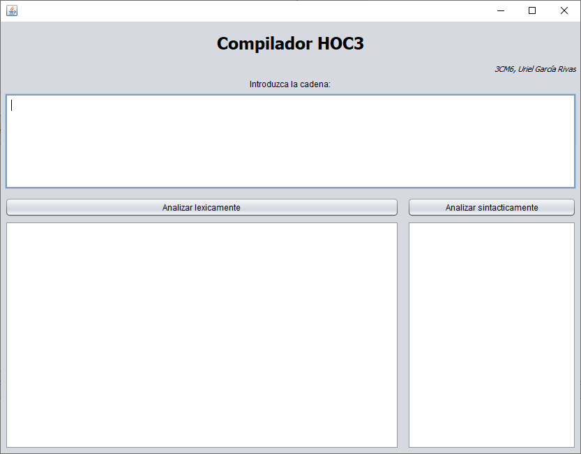
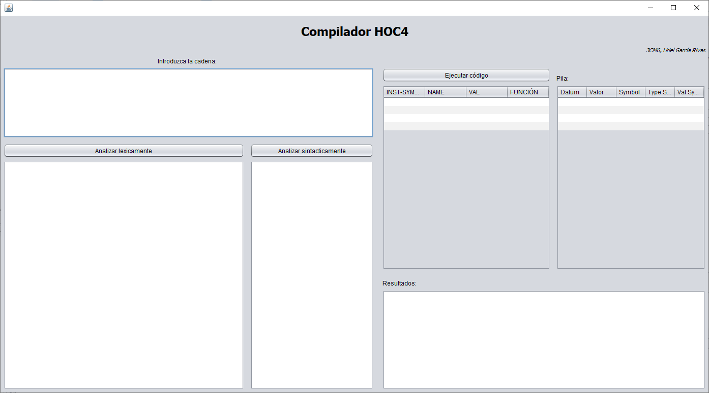
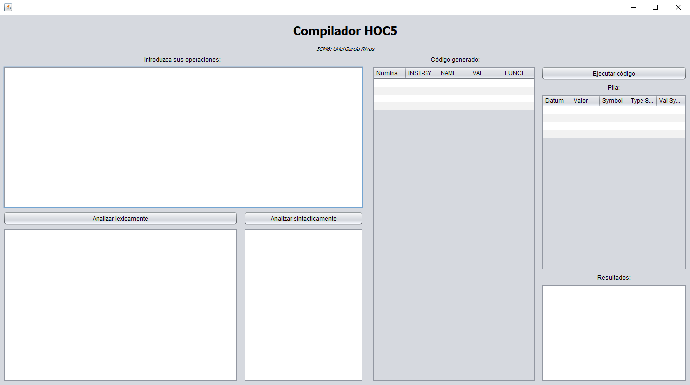
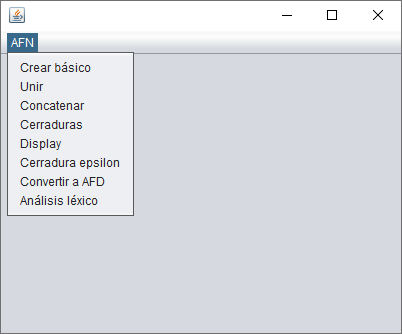

compiler
---------------
All the projects from the course “Compilers” took at the Superior School of Computer Sciences. Built with Java, JFlex and Java CUP.

Table of Contents (ToC):
=========================
* [Hoc3, Hoc4 and Hoc5](#hoc3-hoc4-and-hoc5)
* [Automaton](#automaton)
* [Lexical Analyzer Generator](#lexical-analyzer-generator)

## Hoc3, Hoc4 and Hoc5
Compilers based on lexical and syntactic analysis that read a code given by the user, and recognize and execute loops, if statements, if-else statements, assignments and more.

Hoc3

Hoc4

Hoc5

---

## Automaton
Implementation of the Lexical Analyzer Generator.

Automaton

---

## Lexical Analyzer Generator
The Lexical Analyzer Generator (Generador de analizadores léxicos) generates automatons in order to use them as a lexical analyzer afterwards.
